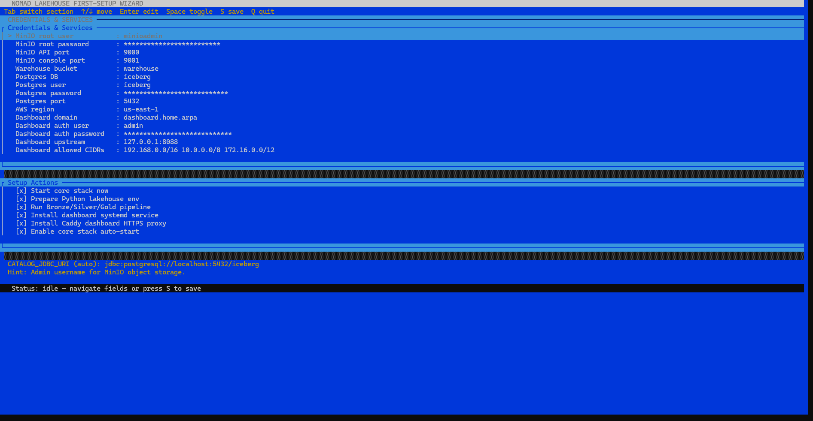

# Nomad Lakehouse

<p align="center">
 
</p>

Local-first data lakehouse for Ubuntu servers and homelabs — with an interactive setup wizard, Bronze/Silver/Gold medallion pipeline, and a real-time admin dashboard.

---

## 🎬 What's New

| Feature                               | What it does                                                                                                                                             |
| ------------------------------------- | -------------------------------------------------------------------------------------------------------------------------------------------------------- |
| **🖥️ Colored TUI Wizard**     | Interactive OpenTUI-based setup with reactive signals, flexbox layout, and keybindings — sets credentials, ports, and automation preferences in one session |
| **📊 Admin Dashboard**          | FastAPI dashboard with four views: Overview, Pipeline Health, Data Quality, and Security                                                                 |
| **🪜 Stack Diagram**            | Architecture visualization showing the full lakehouse data flow from MinIO → Iceberg → DuckDB → Dashboard                                             |
| **🔗 Catalog Validation**       | `create_bronze_tables.py` validates JDBC connectivity before writing, with rerunnable `CREATE OR REPLACE` semantics                                  |
| **📑 Contract-First Ingestion** | Schema and constraints exported as a versioned JSON contract (`data/contracts/bronze_orders_contract.json`)                                            |
| **🧪 Security Gate**            | Automated pipeline with`pip-audit`, Bandit, and remediation scripts                                                                                    |

---

## 📸 Screenshots

### Setup Wizard TUI

<p align="center">
 
</p>

The first-setup wizard walks you through credentials, ports, and automation preferences with real-time validation. Use **Tab** to switch between sections, arrow keys to navigate, **Enter** to edit, and **S** to save.

### Admin Dashboard

<p align="center">
 
</p>

Four-views dashboard built with FastAPI + Jinja2:
overview → pipeline health → data quality → security. Access locally at `127.0.0.1:8088` or via the Caddy HTTPS reverse proxy on your LAN.

### Stack Architecture Diagram

<p align="center">
 
</p>

Medallion (Bronze → Silver → Gold) data flow over MinIO + Apache Iceberg, queried via DuckDB, monitored via the FastAPI dashboard.

---

## 💼 Why It Works On A Resume Or LinkedIn

- 📐 Shows production-style architecture in a small, explainable footprint
- 🔍 Makes the operational flow visible instead of hiding it behind a managed platform
- 🗣️ Gives you a clean story for data engineering interviews, demos, and portfolio posts
- 🧰 Hands-on with MinIO, Iceberg, DuckDB, FastAPI, Docker Compose, and shell scripting
- 🎯 Demonstrates end-to-end ownership: setup → pipeline → monitoring → security

---

## 🧰 Stack

| Layer          | Technology                 | Role                                                |
| -------------- | -------------------------- | --------------------------------------------------- |
| Object Storage | **MinIO**            | S3-compatible storage for lakehouse files           |
| Metadata       | **PostgreSQL**       | JDBC catalog backend for table state                |
| Table Format   | **Apache Iceberg**   | ACID-compliant table schema direction               |
| Query Engine   | **DuckDB**           | Fast local analytics over Bronze/Silver/Gold tables |
| Pipeline       | **Python 3**         | Ingestion, transformation, and validation scripts   |
| Dashboard      | **FastAPI + Jinja2** | Real-time operational UI with four views            |
| Orchestration  | **Docker Compose**   | Single-machine service coordination                 |
| Front Door     | **Caddy**            | HTTPS reverse proxy with basic auth                 |

---

## 🚀 Quick Start

```bash
git clone https://github.com/ohkandil/nomad-lakehouse nomad-lakehouse
cd nomad-lakehouse
cp .env.example .env
chmod +x scripts/*.sh
INSTALL_PROFILE=lakehouse ./scripts/setup_python_env.sh
source .venv/bin/activate
python3 scripts/configure_setup_tui.py
sudo ./scripts/setup_minio.sh
python3 scripts/create_bronze_tables.py
python3 scripts/bronze_to_silver.py
python3 scripts/silver_to_gold.py
```

### What the TUI wizard sets up

The first-setup wizard (`configure_setup_tui.py`) gives you an interactive OpenTUI terminal with:

- ✏️ **15 configuration fields** — MinIO admin credentials, S3 ports, PostgreSQL connection, bucket name, AWS region, dashboard domain/auth/upstream/CIDRs
- ⚙️ **6 setup actions** — toggle stack auto-start, Python environment creation, pipeline execution, dashboard service, and Caddy HTTPS proxy
- ✅ **Inline validation** — password length, bucket naming, port conflicts, hostname format — all checked before saving
- 🎨 **Depth-styled UI** — title bar, raised button highlights, bordered panels with shadows, and a recessed status bar with color-coded feedback (green success / red error)

When you press **S** to save, the wizard writes `.env`, validates everything, and prints a guided post-save checklist tailored to your toggle selections.

---

## 📊 Dashboard

### Local access

```bash
source .venv/bin/activate
python3 -m uvicorn dashboard.app:app --host 127.0.0.1 --port 8088
```

| Route         | View                                               |
| ------------- | -------------------------------------------------- |
| `/`         | Overview — service health at a glance             |
| `/pipeline` | Pipeline health — Bronze/Silver/Gold run status   |
| `/quality`  | Data quality — contract adherence and row counts  |
| `/security` | Security — audit results and vulnerability status |

### Secure LAN access (Caddy + TLS + basic auth)

```bash
sudo ./scripts/install_dashboard_service.sh
set -a; source .env; set +a
sudo -E ./scripts/install_dashboard_reverse_proxy.sh
```

Then open `https://dashboard.home.arpa` from any device on your LAN.

All four dashboard views are served behind HTTPS with basic-auth credentials you configured in the TUI wizard.

---

## ✅ Features

- 🐧 Linux-first deployment (Ubuntu Server / homelab)
- 🧪 MinIO + PostgreSQL health checks and systemd auto-start
- 🪣 Bucket bootstrap and environment setup
- 📄 Bronze ingestion contract generation
- 🪄 Bronze table materialization with rerunnable `CREATE OR REPLACE`
- 🌊 Bronze → Silver → Gold starter pipeline
- 📊 Four-view admin dashboard with API-driven status
- 🔐 Security gate: `pip-audit`, Bandit, and remediation scripts
- 🤖 CI pipeline with lint (Ruff), typing (mypy), tests (pytest), and security
- 🎨 Interactive OpenTUI-based TUI with reactive layout

---

## 🔐 Security Workflow

Mandatory stage gate before committing:

```bash
sudo ./scripts/security_scan.sh
python3 -m pip_audit --skip-editable --ignore-vuln CVE-2026-3219
python3 -m bandit -r scripts
```

If vulnerabilities are found:

```bash
./scripts/remediate_python_vulns.sh
python3 -m pip_audit --skip-editable --ignore-vuln CVE-2026-3219
```

---

## 🧪 Validation

### Week 1 — Core stack

1. `sudo ./scripts/setup_minio.sh`
2. `sudo ./scripts/healthcheck.sh`
3. `sudo ./scripts/install_systemd_service.sh`
4. Reboot and verify `nomad-lakehouse.service` auto-starts
5. `./scripts/setup_python_env.sh`
6. Run all three pipeline scripts
7. Verify outputs in `data/output/`
8. Run the security workflow and log findings
9. Record evidence in `docs/week1-closure.md`

### Week 2 — Catalog & contracts

1. Ensure services are running: `sudo ./scripts/setup_minio.sh`
2. Activate environment: `source .venv/bin/activate`
3. Run Bronze workflow: `python3 scripts/create_bronze_tables.py`
4. Verify the generated contract: `cat data/contracts/bronze_orders_contract.json`
5. Verify the Bronze table is queryable:

```bash
python3 - <<'PY'
import duckdb

con = duckdb.connect("data/output/lakehouse.duckdb")
print(con.execute("SELECT COUNT(*) AS rows FROM bronze.orders").fetchall())
print(con.execute("SELECT * FROM bronze.orders ORDER BY order_id LIMIT 5").fetchdf())
PY
```

1. Record evidence in `docs/week2-closure.md`

> Current verification evidence may vary by host environment. Treat the week-closure docs as the source of truth for your latest local validation run.

---

## 🛣️ Roadmap

- [ ] Full Iceberg table commit flow (beyond DuckDB materialization)
- [ ] Incremental ingestion with watermark tracking
- [ ] Stronger data quality contracts with automated enforcement
- [ ] Richer observability and operational diagnostics
- [ ] Near plug-and-play deployment with minimal user input

---

## 📚 Documentation Index

| Document                         | Description                        |
| -------------------------------- | ---------------------------------- |
| `docs/setup.md`                | Environment setup guide            |
| `docs/ubuntu-deploy.md`        | Full deployment runbook            |
| `docs/architecture.md`         | Architecture overview              |
| `docs/examples.md`             | Pipeline and query examples        |
| `docs/admin-dashboard-plan.md` | Dashboard implementation plan      |
| `docs/admin-dashboard.md`      | Dashboard usage and endpoints      |
| `docs/onboarding.md`           | Onboarding guide for new engineers |
| `docs/week1-closure.md`        | Week 1 validation evidence         |
| `docs/week2-closure.md`        | Week 2 validation evidence         |
| `PROJECT_PLAN.md`              | Long-term implementation roadmap   |
| `Local_Lakehouse_MVP.md`       | Original MVP specification         |

---

## 🗂️ Repository Layout

```text
.
├── docker-compose.yml        # MinIO + PostgreSQL orchestration
├── pyproject.toml            # Python deps, tool config, metadata
├── scripts/
│   ├── configure_setup_tui.py    # Colored interactive TUI wizard
│   ├── create_bronze_tables.py   # Bronze ingestion + contract
│   ├── bronze_to_silver.py       # Silver transformation
│   ├── silver_to_gold.py         # Gold aggregation
│   ├── setup_minio.sh            # MinIO + PostgreSQL launcher
│   ├── setup_python_env.sh       # Virtual env creation
│   ├── healthcheck.sh            # Service health probes
│   └── security_scan.sh          # pip-audit + Bandit runner
├── dashboard/
│   ├── app.py                    # FastAPI application
│   ├── health_sources.py         # Service health collectors
│   ├── pipeline_sources.py       # Pipeline status collectors
│   ├── security_sources.py       # Security audit collectors
│   ├── templates/                # Jinja2 HTML templates
│   └── static/                   # Dashboard assets
├── docs/
│   ├── assets/                   # Logo, screenshots, diagrams
│   ├── architecture.md
│   └── ...                       # Full documentation
├── data/
│   ├── contracts/                # Versioned ingestion contracts
│   ├── output/                   # DuckDB database files
│   └── sample/                   # Sample source data
└── tests/
```

---

## 👤 Portfolio Notes

This repository is structured so a junior engineer can clearly present project ownership:

- **Problem framing** — local-first lakehouse that mirrors production patterns without cloud spend
- **Technical depth** — medallion architecture, contract-based ingestion, JDBC-backed catalog connectivity, interactive TUI wizard
- **Engineering maturity** — CI, type checks, security scanning, and documentation discipline
- **Communication quality** — setup guides, architecture notes, examples, screenshot placeholders, and closure evidence artifacts

---

## 📄 License

See `LICENSE`.
